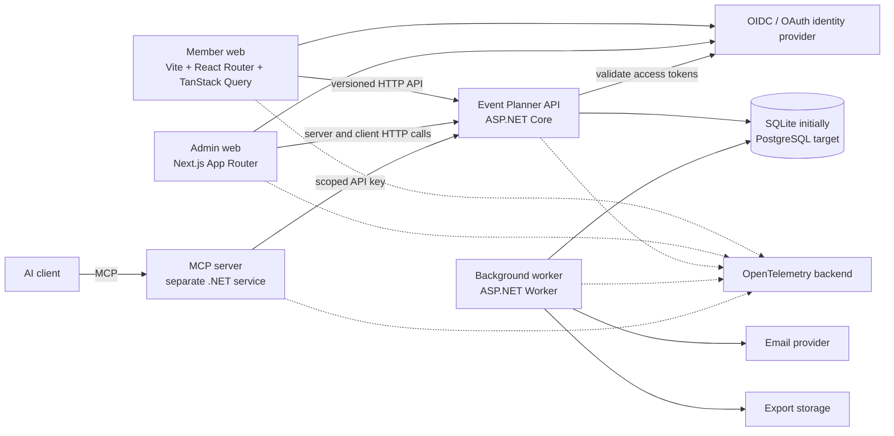
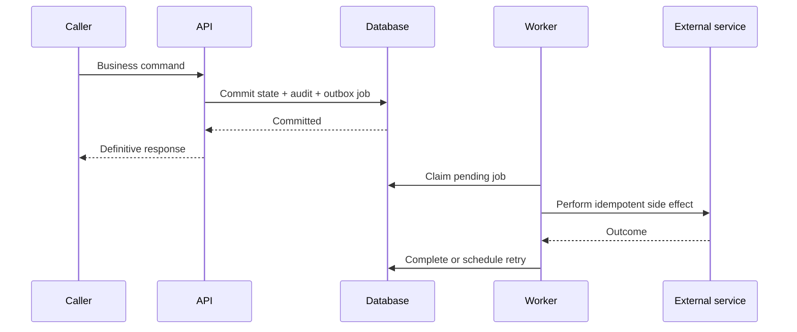

# Architecture overview

## Outcome

Event Planner is a private, multi-tenant event-planning platform with two
deliberately different React frontends, one authoritative .NET backend, and a
future MCP adapter for controlled AI-assisted catalogue proposals.

The architecture is a modular monolith first. It makes business and
infrastructure boundaries explicit enough for later service extraction without
paying the operational and consistency costs of microservices now.

## System context



The two web applications and MCP server never access the database. The API is
authoritative for identity resolution, permissions, tenant isolation,
validation, state transitions, concurrency, idempotency, and audit records.

## Frontend boundaries

The frontend repository becomes an npm workspace:

```text
apps/member-web     Vite SPA for catalogue, favourites, and plans
apps/admin-web      Next.js application for tenant and platform administration
packages/api-client generated models and clients from backend OpenAPI
packages/ui         small shared primitive/token layer
```

The member application remains client rendered. The admin application uses
Next.js App Router, layouts, Server Components, and server-side initial loading,
with Client Components for interactive forms and mutations. This is an
intentional learning comparison, not an attempt to make both applications share
one rendering abstraction.

Tenant routes use immutable GUIDs:

```text
https://app.example.com/{tenantId}/...
https://admin.example.com/{tenantId}/...
https://admin.example.com/platform/...
```

Both applications call the .NET API. Next.js is not a second business backend.

## Backend boundaries

```text
GigPlanner.Api             HTTP transport and host composition
GigPlanner.Application     use cases, authorization, ports, transactions
GigPlanner.Domain          business models, policies, and invariants
GigPlanner.Infrastructure  EF Core and external adapters
GigPlanner.Worker          background host
GigPlanner.Contracts       stable public contract types where useful
```

Dependencies point toward business meaning:

```text
HTTP endpoint
  -> application use case
    -> domain policy/model
      -> capability-specific port
        -> infrastructure adapter
```

Application use cases depend on focused interfaces such as event, plan,
membership, audit, and export repositories. They do not depend on EF Core,
`DbSet`, `IQueryable`, or a generic repository. These boundaries can later
become service contracts if operational evidence justifies extraction.

## Tenant and data model

A tenant is an isolated workspace. A user may hold different roles in multiple
tenants and can switch active tenant in each application. The server persists a
last-active-tenant preference per user and application but revalidates access on
every entry.

One shared database/schema contains platform and tenant data. Every
tenant-owned record includes `TenantId`; repository inputs, relationships,
indexes, authorization policies, and negative tests enforce the boundary.

Core tenant data includes:

- Tenant and tenant settings;
- Membership and Invitation;
- Event, Participant, Place, Category, and Tag;
- CustomFieldDefinition and typed EventCustomFieldValue;
- Favourite;
- Plan, ordered PlanEntry, and PlanAccessGrant;
- IntegrationServiceAccount and API-key metadata;
- EventProposal and provenance;
- AuditEntry, OutboxJob, and IdempotencyRecord;
- user/application preference.

Events are one-offs. They have independent publication, lifecycle, and
availability states. Tenant-defined custom fields extend a stable common event
schema without allowing integrations to mutate tenant schema.

## Authentication and authorization

Production uses a vendor-neutral OpenID Connect/OAuth 2.x design with
Authorization Code and PKCE. The shared identity-provider session supplies SSO,
while each application maintains its own secure application session.

- Next.js holds API tokens server-side for Server Component access.
- The Vite SPA holds short-lived access tokens in memory, not local storage.
- The API validates audience-restricted tokens and resolves application roles
  and memberships from its database.
- Development uses a development-only signed-token issuer with server-defined
  personas; the current caller-controlled role header is removed.

Tenant authorization is operation-specific. A tenant ID in a URL, request, or
token is never proof of access. Platform administrators act as themselves, can
operate across tenants, and cannot impersonate users.

## Command, query, and transaction behavior

Member and admin interactions use synchronous HTTP when the caller needs a
definitive result. Each command uses the smallest database transaction that
keeps the primary state, invariant checks, concurrency token, idempotency
record, required audit entry, and outbox job consistent.

Examples:

- Creating a tenant atomically creates the tenant and its initial owner
  membership.
- Accepting an invitation atomically consumes the invitation and creates the
  matching-email membership.
- Approving a proposal atomically verifies versions, updates or creates the
  event, records provenance, and writes the audit entry.
- Leaving a tenant atomically checks owner/plan obligations, removes access,
  and clears invalid preferences.

Plans and proposals use optimistic concurrency and return a conflict instead of
silently overwriting a newer version.

## Background work and reliability

Slow, delayed, and externally unreliable work runs after commit through a
transactional outbox:



The worker runs in-process locally and as a separate production deployment.
Handlers assume at-least-once execution, use bounded retries/backoff, and leave
terminal failures inspectable and replayable. A database-backed queue is enough
initially; a message broker can replace the dispatch adapter later.

Background work includes invitation email, delayed tenant/account purge, audit
retention, and tenant export generation/cleanup.

## Integration and MCP

Tenant-scoped service accounts authenticate with hashed, revocable, rotatable,
optionally expiring API keys. Narrow scopes permit necessary catalogue/schema
reads and proposal writes. Integration writes require a 30-day idempotency key
record and at least one source reference.

Integrations create proposals, never published events. Deterministic duplicate
detection returns candidates; a human editor reviews the complete proposal,
may edit it, and approves or rejects it holistically.

The separately deployed MCP server exposes read/search/propose/status tools and
calls the same HTTP API. It has no publishing, approval, membership, credential,
or schema-management tools.

## Operations and evolution

- SQLite is the initial provider; PostgreSQL is the first production target.
- The backend owns OpenAPI; frontend clients are generated from a checked-in
  snapshot with CI freshness checks.
- All deployables emit OpenTelemetry-compatible logs, metrics, and traces.
- Application audit records are append-only and retained for three months.
- Unsuccessful access attempts belong in security logs/metrics rather than the
  application audit trail.
- Tenant deletion is recoverable for 30 days; account deletion for 14 days.
- Tenant exports use an `IExportStorage` port and expire after 24 hours.
- Docker, file uploads, recurrence, public catalogues, comments, and formal
  accessibility/responsive acceptance are deferred.

See the [permission matrix](./permission-matrix.md), [roadmap](./roadmap.md), and
[traceability checklist](./traceability.md) for implementation handoff.
